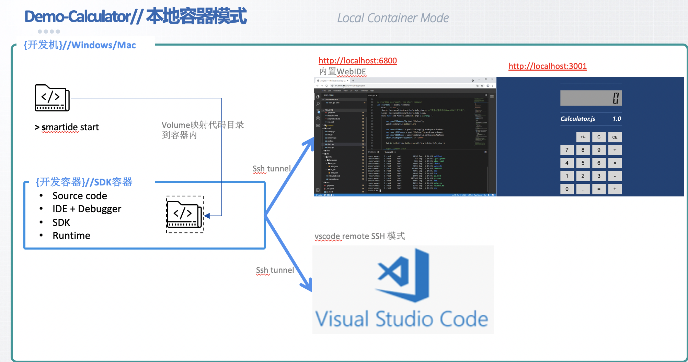
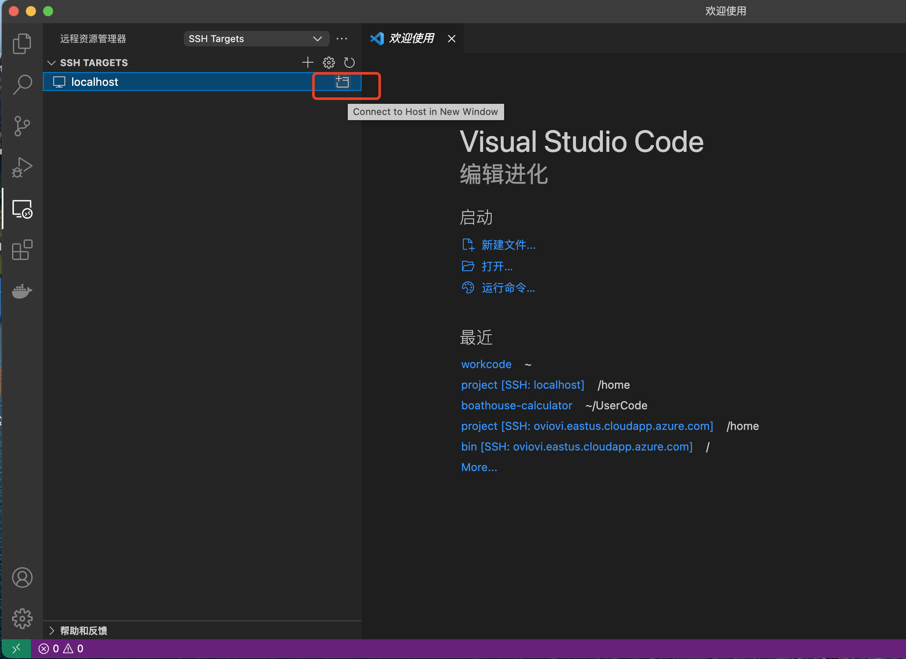

# 整体说明

本demo示例提供两个场景，开发人员通过本地运行SmartIDE可以使用webide和使用本地开发工具链接SmartIDE生成的开发容器进行代码调试，全程无需再安装调试所需环境。
SmartIDE将通过隧道技术以及动态端口映射机制提供开发人员与本地开发调试一样的开发体验。

- SmartIDE本地运行，使用WebIDE方式调试
- 使用本地VScode链接SmartIDE开发容器调试



##  场景1.SmartIDE本地运行，使用WebIDE方式调试

1. clone代码库

```shell
git clone https://github.com/idcf-boat-house/boathouse-calculator.git
cd boathouse-calculator
```

2. 快速创建并启动SmartIDE开发环境

```shell
smartide start 
```


在打开的WebIDE 中打开 terminal，并启动项目

```shell
npm install 
npm start 
```


可以看到应用已在容器3001端口启动，这时通过隧道转发机制，我们可以直接通过 http://localhost:3001/ 打开应用

3.添加断点调试程序

在终端中，使用‘Ctrl+z’终止进程


添加断点 **/api/controllers/arithmeticController.js**  的line47


输入 **F5** 启动调试，打开 http://localhost:3001/ 即可通过使用计算器进入调试步骤


##  场景2.使用本地VScode链接SmartIDE开发容器调试

1.VScode安装插件 **Remote Development**


2.新建SSH连接并保存到配置文件


3.打开SSH连接，中间需要多次输入密码



4.打开远程容器目录


5.npm i安装依赖包，运行和调试


